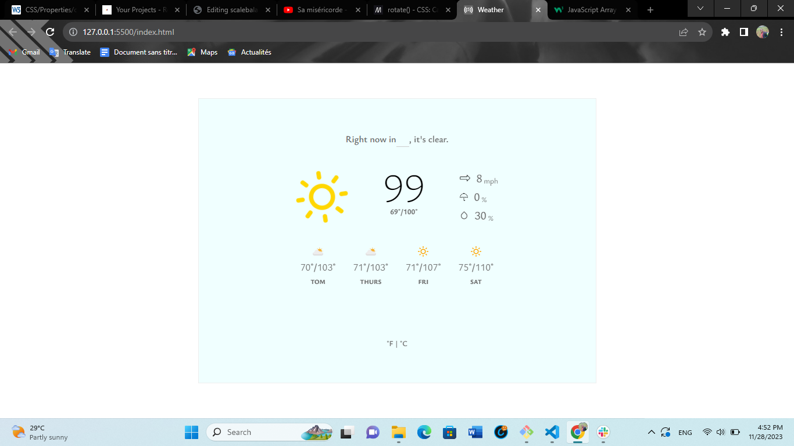

# Weather-App
A simple weather app build in with HTML, CSS and JavaScript with the use of dummy data for temperature, atmospheric pressure, wind speed just to name a few.
## App

## Built with
- HTML
- CSS
- JavaScript
### Prerequisites
Knowlegde about:
- HTML
- CSS
- JavaScript
- Feather-icons
### Clone project
Get a local copy of this project by following the steps below:
- $ git clone `git@github.com:lontsimesmer/weather-app.git`
- $ On main branch do `git checkout feature/climax`
### Start up
- Run using liveserver or index.html from the browser
: bust_in_silhouette: **lontsimesmer**
### :handshake: Contributions
Contributions, issues and feature request are welcome.
Feel free to drop them here [issues page](https://github.com/lontsimesmer/weather-app/issues)
### :memo: License
This project is [rebaseacademy](./LICENSE) licensed.
